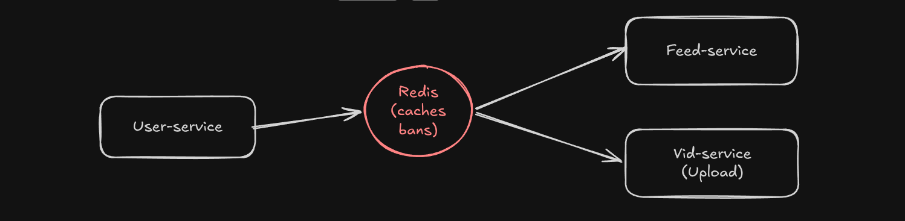
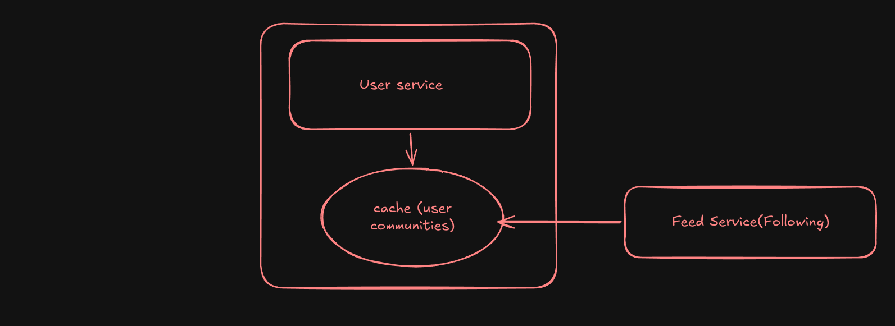
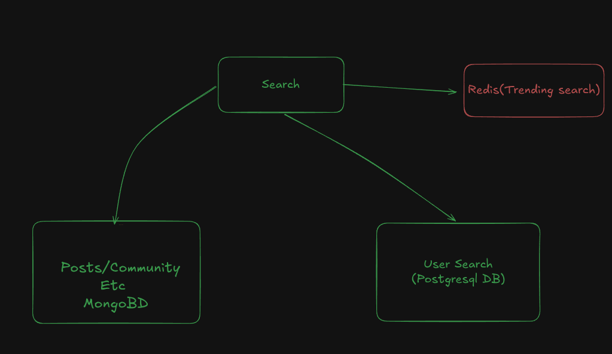

# Guide 

## This simple Diagram For the app if it's Deployed on many servers THANKS NGINX

---

## This Diagram for the Block / Ban Handling between user and feed Services

---

## This Diagram for Following feed

---

## Search Diagram 
  Search is divide into 3 Models MongoDB (Main), Postgresql (user) and Redis(Trending)
   - Mongo: Everything except User Model 
   - Postgresql: User's Model Only
   - Redis: trending posts only
 
**Search Client** : Should redirect to The right DB, For example the user should type in search Bar u/WaelAlbyaid to search for user else it won't work for user searching 

